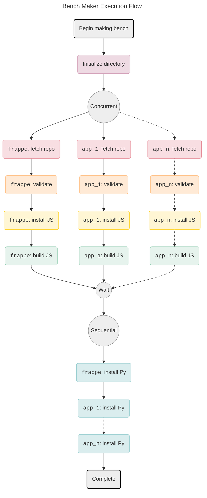

# Bench Maker

> [!IMPORTANT]
>
> This is proof of concept for the **Bench Maker**. At present, it does not
> create a working bench, just verifies the ideas by running the time consuming
> stages that make a bench.
>
> See the [POC](#poc) section.

Bench Maker is a performant `bench` replacement. Specifically it is meant to replace the `bench init` and `bench get-app` commands.

## Why

The main purpose of this is to be used by _Frappe Cloud_ to speed up builds.
Majority of the time spent in a build is spent in the App Install stages which
involves running `bench get-app` sequentially for a selection of _Frappe Apps_.

## How

The `bench init` and `bench get-app` command when utilized for more than one app, consist of mutually independent steps that can be run concurrently. This is better explained by use of a graph:



4 out of the 5 app stages involved in making a bench can be run concurrently.

> [!NOTE]
>
> Installing Python dependencies have to be run sequentially because all apps on
> a _Frappe Bench_ share the same python environment.

## POC

This is as of now a proof of concept. It may or may not be fleshed out. The
ideas and implementations I wanted to test out and have been verified are:

- Concurrent installation of _Frappe Apps_ being possible.
- Concurrent installation of _Frappe Apps_ taking much lesser time than sequential installation.
- Multiplexing of output from concurrent installs.
- Being able to cleanly stop execution if any app install fails.

Few things I have not yet tested out are:

- Building a working bench using bench maker
- Performance impact of multiple instances of bench maker running separately.
- Speed up from using alternative package managers than `yarn` or `pip`.
- Speed up from caching different stages. As of now only the fetch app stage is
  non optimally cached, other than that `yarn` and `pip` use their own caches.

### Run

> [!NOTE]
>
> To build this you'll need Go > 1.22.4.

```bash
# Build the Bench Maker binary `bm`
go build

# Example
./bm --apps erpnext hrms gameplan builder

# Example without cache
./bm --no-cache --apps erpnext hrms gameplan builder

# Example sequential install
./bm --seq --apps erpnext hrms gameplan builder
```

This will create a `temp` folder:

- `temp/bench`: dummy bench where the apps are installed.
- `temp/.cache`: where the repos, `yarn` and `pip` cache are.

## Time taken

### Concurrent

<details>
<summary>1. Empty cache. Wall time 470.710s. Time saved 465.883s.</summary>

```shell
# bm --apps erpnext hrms drive builder

Time Breakdown:
| org/repo         |     clone |  validate |    ins js |     build |    ins py |     total |
|------------------|-----------|-----------|-----------|-----------|-----------|-----------|
| frappe/drive     |    9.284s |    0.000s |   37.399s |   12.317s |    2.777s |   61.777s |
| frappe/hrms      |   11.015s |    0.000s |  435.528s |    6.674s |    2.732s |  455.950s |
| frappe/erpnext   |   12.659s |    0.000s |    0.908s |    0.000s |    2.825s |   16.392s |
| frappe/frappe    |   13.112s |    0.000s |   71.343s |    0.922s |    4.424s |   89.802s |
| frappe/builder   |    1.660s |    0.000s |  299.026s |    7.252s |    2.705s |  310.644s |

Totals:
Bench init            :    2.028s
Concurrent app stages :  919.101s
Sequential app stages :   15.464s
---------------------------------
Total app             :  934.565s
Total app + bench     :  936.593s
---------------------------------
Total wall time       :  470.710s
Time saved            :  465.883s
```

</details>

<details>
<summary>2. Network issue (hrms). Wall time 324.544s. Time saved 92.5s.</summary>

```shell
# bm --apps erpnext hrms drive builder

Time Breakdown:
| org/repo         |     clone |  validate |    ins js |     build |    ins py |     total |
|------------------|-----------|-----------|-----------|-----------|-----------|-----------|
| frappe/builder   |    0.098s |    0.000s |   13.320s |    8.037s |    2.665s |   24.121s |
| frappe/drive     |    0.161s |    0.000s |   43.473s |   12.926s |    2.764s |   59.324s |
| frappe/hrms      |    0.405s |    0.000s |  300.492s |    6.574s |    2.661s |  310.131s |
| frappe/frappe    |    0.855s |    0.000s |   11.198s |    1.059s |    4.173s |   17.285s |
| frappe/erpnext   |    1.163s |    0.000s |    0.211s |    0.000s |    2.811s |    4.185s |

Totals:
Bench init            :    1.998s
Concurrent app stages :  399.970s
Sequential app stages :   15.075s
---------------------------------
Total app             :  415.045s
Total app + bench     :  417.044s
---------------------------------
Total wall time       :  324.544s
Time saved            :   92.500s
```

```shell
# When installing JS dependencies for frappe/hrms
info There appears to be trouble with your network connection. Retrying...
```

</details>

<details>
<summary>3. Other issue (hrms). Wall time 323.877. Time saved 88.727s.</summary>

```shell
# bm --apps erpnext hrms drive builder

Time Breakdown:
| org/repo         |     clone |  validate |    ins js |     build |    ins py |     total |
|------------------|-----------|-----------|-----------|-----------|-----------|-----------|
| frappe/drive     |    0.160s |    0.000s |   41.922s |   12.261s |    2.819s |   57.162s |
| frappe/hrms      |    0.462s |    0.000s |  299.386s |    6.682s |    2.682s |  309.212s |
| frappe/frappe    |    0.910s |    0.000s |    9.456s |    1.390s |    4.222s |   15.978s |
| frappe/erpnext   |    1.172s |    0.000s |    0.188s |    0.000s |    2.808s |    4.168s |
| frappe/builder   |    0.094s |    0.000s |   13.599s |    7.576s |    2.747s |   24.015s |

Totals:
Bench init            :    2.070s
Concurrent app stages :  395.257s
Sequential app stages :   15.277s
---------------------------------
Total app             :  410.535s
Total app + bench     :  412.604s
---------------------------------
Total wall time       :  323.877s
Time saved            :   88.727s
```

HRMS build stuck for ~5 minutes at the following line (line occurred previously in build too):

```bash
 warning Pattern ["wrap-ansi@^7.0.0"] is trying to unpack in the same destination "bm_poc/temp/bench/apps/hrms/frontend/temp/.cache/yarn/v6/npm-wrap-ansi-cjs-7.0.0-67e145cff510a6a6984bdf1152911d69d2eb9e43-integrity/node_modules/wrap-ansi-cjs" as pattern ["wrap-ansi-cjs@npm:wrap-ansi@^7.0.0"]. This could result in non-deterministic behavior, skipping.
```

</details>

<details>
<summary>4. No hrms. Wall time 60.820s. Time saved 27.850s.</summary>

```bash
# bm --apps erpnext drive builder

Time Breakdown:
| org/repo         |     clone |  validate |    ins js |     build |    ins py |     total |
|------------------|-----------|-----------|-----------|-----------|-----------|-----------|
| frappe/builder   |    0.079s |    0.000s |   10.129s |    7.852s |    2.712s |   20.772s |
| frappe/drive     |    0.133s |    0.000s |   33.102s |   13.059s |    2.790s |   49.084s |
| frappe/frappe    |    0.724s |    0.000s |    6.975s |    1.038s |    4.118s |   12.855s |
| frappe/erpnext   |    0.914s |    0.000s |    0.141s |    0.000s |    2.813s |    3.868s |

Totals:
Bench init            :    2.091s
Concurrent app stages :   74.145s
Sequential app stages :   12.434s
---------------------------------
Total app             :   86.579s
Total app + bench     :   88.671s
---------------------------------
Total wall time       :   60.820s
Time saved            :   27.850s
```

</details>

### Sequential

<details>

<summary>1. No cache. Wall time 1034.717s. Time saved 0s.</summary>

```bash
# bm --seq --apps erpnext hrms drive builder

Time Breakdown:
| org/repo         |     clone |  validate |    ins js |     build |    ins py |  complete |      stop |     total |
|------------------|-----------|-----------|-----------|-----------|-----------|-----------|-----------|-----------|
| frappe/frappe    |    4.957s |    0.000s |  222.984s |    0.796s |    4.241s |    0.000s |    0.000s |  232.977s |
| frappe/erpnext   |    5.888s |    0.000s |    0.497s |    0.000s |    2.842s |    0.000s |    0.000s |    9.228s |
| frappe/hrms      |    2.734s |    0.000s |  529.143s |    6.487s |    2.645s |    0.000s |    0.000s |  541.010s |
| frappe/drive     |    3.023s |    0.000s |   30.326s |   12.125s |    2.734s |    0.000s |    0.000s |   48.208s |
| frappe/builder   |    1.677s |    0.000s |  189.298s |    7.098s |    2.643s |    0.000s |    0.000s |  200.716s |

Totals:
Bench init            :    2.578s
Concurrent app stages : 1017.035s
Sequential app stages :   15.104s
---------------------------------
Total app             : 1032.139s
Total app + bench     : 1034.717s
---------------------------------
Total wall time       : 1034.717s
Time saved            :   -0.000s
```

</details>

<details>

<summary>2. Wall time 268.063. Time saved 0s.</summary>

```bash
# bm --seq --apps erpnext hrms drive builder

Time Breakdown:
| org/repo         |     clone |  validate |    ins js |     build |    ins py |     total |
|------------------|-----------|-----------|-----------|-----------|-----------|-----------|
| frappe/builder   |    0.034s |    0.000s |    6.850s |    7.150s |    2.722s |   16.756s |
| frappe/frappe    |    0.456s |    0.000s |    4.420s |    0.711s |    4.502s |   10.088s |
| frappe/erpnext   |    0.656s |    0.000s |    0.130s |    0.000s |    2.968s |    3.754s |
| frappe/hrms      |    0.233s |    0.000s |  177.555s |    6.661s |    2.733s |  187.181s |
| frappe/drive     |    0.085s |    0.000s |   33.169s |   12.223s |    2.753s |   48.231s |

Totals:
Bench init            :    2.052s
Concurrent app stages :  250.333s
Sequential app stages :   15.677s
---------------------------------
Total app             :  266.010s
Total app + bench     :  268.063s
---------------------------------
Total wall time       :  268.063s
Time saved            :   -0.000s
```

</details>

<details>
<summary>3. No cache. No hrms. Wall time 427.232s. Time saved 0s.</summary>

```bash
# bm --seq --apps erpnext drive builder

Time Breakdown:
| org/repo         |     clone |  validate |    ins js |     build |    ins py |     total |
|------------------|-----------|-----------|-----------|-----------|-----------|-----------|
| frappe/frappe    |    3.267s |    0.000s |  154.176s |    0.749s |    3.905s |  162.097s |
| frappe/erpnext   |    5.044s |    0.000s |    0.865s |    0.000s |    2.892s |    8.801s |
| frappe/drive     |    1.925s |    0.000s |   28.502s |   12.367s |    2.717s |   45.511s |
| frappe/builder   |    1.106s |    0.000s |  197.903s |    7.058s |    2.606s |  208.673s |

Totals:
Bench init            :    2.149s
Concurrent app stages :  412.963s
Sequential app stages :   12.120s
---------------------------------
Total app             :  425.083s
Total app + bench     :  427.232s
---------------------------------
Total wall time       :  427.232s
Time saved            :   -0.000s
```

</details>

<details>

<summary>4. No hrms. Wall time 74.429s. Time saved 0s.</summary>

```bash
# bm --seq --apps erpnext drive builder

Time Breakdown:
| org/repo         |     clone |  validate |    ins js |     build |    ins py |     total |
|------------------|-----------|-----------|-----------|-----------|-----------|-----------|
| frappe/frappe    |    0.429s |    0.000s |    4.262s |    0.713s |    4.229s |    9.633s |
| frappe/erpnext   |    0.588s |    0.000s |    0.130s |    0.000s |    2.855s |    3.573s |
| frappe/drive     |    0.077s |    0.000s |   28.715s |   12.033s |    2.789s |   43.615s |
| frappe/builder   |    0.038s |    0.000s |    5.756s |    7.132s |    2.696s |   15.622s |

Totals:
Bench init            :    1.985s
Concurrent app stages :   59.874s
Sequential app stages :   12.569s
---------------------------------
Total app             :   72.444s
Total app + bench     :   74.429s
---------------------------------
Total wall time       :   74.429s
Time saved            :   -0.000s
```

</details>

## Glossary

A glossary has been included cause due to asinine naming, the term "bench" is
terribly overloaded. In the context of FC, it refers to at least 4 different
things.

- **_Frappe Bench_**: A collection of _Frappe Apps_ managed by `bench`.
- **`bench`**: [Tool](https://github.com/frappe/bench) used to manage _Frappe Benches_.
- **_Frappe App_**: A web-app built using FF.
- **_Frappe Cloud_**: [Platform](https://frappecloud.com/) that hosts _Frappe Benches_.
- **BM**: Bench Maker.
- **FF**: [Frappe Framework](https://github.com/frappe/frappe).
- **FC**: Frappe Cloud.
