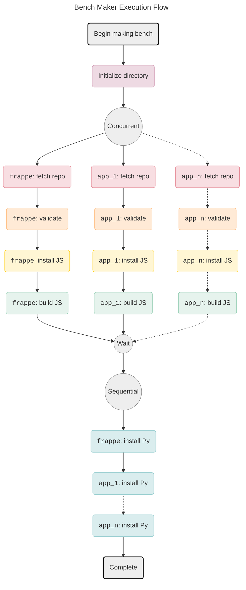

# Bench Maker

> [!IMPORTANT]
>
> This is proof of concept for the **Bench Maker**. At present, it does not
> create a working bench, just verifies the ideas.
>
> See the [#POC](#poc) section.

Bench Maker is a performant `bench` replacement. Specifically it is meant to replace the `bench init` and `bench get-app` commands.

## Why

The main purpose of this is to be used by _Frappe Cloud_ to speed up builds.
Majority of the time spent in a build is spent in the App Install stages which
involves running `bench get-app` sequentially for a selection of _Frappe Apps_.

## How

The `bench init` and `bench get-app` command when utilized for more than one app, consist of mutually independent steps that can be run concurrently. This is better explained by use of a graph:

4 out of the 5 app stages involved in making a bench can be run concurrently.

> [!NOTE]
>
> Installing Python dependencies have to be run sequentially because all apps on
> a _Frappe Bench_ share the same python environment.

## POC

This is as of now a proof of concept. It may or may not be fleshed out. The
ideas and implementations I wanted to test out and have been verified are:

- Concurrent installation of _Frappe Apps_ being possible.
- Concurrent installation of _Frappe Apps_ much lesser time than sequential installation.
- Multiplexing of output from concurrent installs.
- Being able to cleanly stop execution if any app install fails.

Few things I have not yet tested out are:

- Building a working bench using bench maker
- Performance impact of multiple instances of bench maker running separately.
- Speed up from using alternative package managers than `yarn` or `pip`.
- Speed up from caching different stages. As of now only the fetch app stage is
  non optimally cached, other than that `yarn` and `pip` use their own caches.

## Results

## Glossary

A glossary has been included cause due to asinine naming, the term "bench" is
terribly overloaded. In the context of FC, it refers to at least 4 different
things.

- **_Frappe Bench_**: A collection of _Frappe Apps_ managed by `bench`.
- **`bench`**: [Tool](https://github.com/frappe/bench) used to manage _Frappe Benches_.
- **_Frappe App_**: A web-app built using FF.
- **_Frappe Cloud_**: [Platform](https://frappecloud.com/) that hosts _Frappe Benches_.
- **BM**: Bench Maker.
- **FF**: [Frappe Framework](https://github.com/frappe/frappe).
- **FC**: Frappe Cloud.
