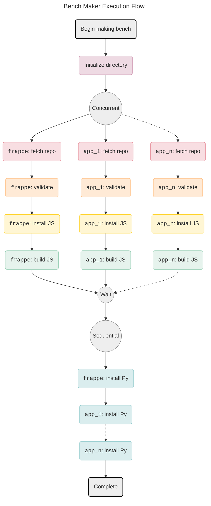

> [!IMPORTANT]
>
> This is an experiment for the **Bench Maker** concept. At present, it does not
> create a working bench. It just verifies the ideas by running the time consuming
> stages that make a bench.
>
> See the [Experiment](#experiment) section.


Bench Maker is to be a performant `bench init` + `bench get-app` replacement.

**Index**:

- [Why](#why)
- [How](#how)
- [Experiment](#experiment)
- [How to run](#how-to-run)
- [Results](#results)
- [Issues](#issues)
- [Thoughts](#thoughts)
- [Next](#next)
- [Glossary](#glossary)

## Why

The main purpose of this is to be used by _Frappe Cloud_ to speed up builds.
Majority of the time spent in a build is spent in the App Install stages which
involves running `bench get-app` sequentially for a selection of _Frappe Apps_.

## How

The `bench init` and `bench get-app` command when utilized for more than one
app, consist of mutually independent steps that can be run concurrently. This is
better explained by use of a graph:



4 out of the 5 app stages involved in making a bench can be run concurrently.

> [!NOTE]
>
> Installing Python dependencies have to be run sequentially because all apps on
> a _Frappe Bench_ share the same python environment.

## Experiment

This is as of now an experiment. It may or may not be fleshed out. The ideas I
wanted to test out were:

- Concurrent installation of _Frappe Apps_ being possible.
- Concurrent installation of _Frappe Apps_ taking much lesser time than sequential installation.
- Multiplexing of output from concurrent installs.
- Being able to cleanly stop execution if any app install fails.

The above were tested out but the outcomes didn't have repeatability, check the
[Issues](#issues) section for more info.

Few things I have not yet tested out are:

- Building a working bench using bench maker
- Performance impact of multiple instances of bench maker running separately.
- Speed up from using alternative package managers than `yarn` or `pip`.
- Speed up from caching different stages. As of now only the fetch app stage is
  non optimally cached, other than that `yarn` and `pip` use their own caches.

## How to run

> [!NOTE]
>
> To build this you'll need Go > 1.22.4.

```bash
# Build the Bench Maker binary `bm`
go build

# Example
./bm --apps erpnext hrms gameplan builder

# Example without cache
./bm --no-cache --apps erpnext hrms gameplan builder

# Example sequential install
./bm --seq --apps erpnext hrms gameplan builder
```

This will create a `temp` folder:

- `temp/bench`: dummy bench where the apps are installed.
- `temp/.cache`: where the repos, `yarn` and `pip` cache are.

## Results

Unless mentioned otherwise, the build times are based off of cached assets.

### Concurrent: `erpnext [hrms] drive builder`

<details>
<summary>1. No cache. Wall time 470.710s. Time saved 465.883s.</summary>

```shell
# bm --apps erpnext hrms drive builder

Time Breakdown:
| org/repo         |     clone |  validate |    ins js |     build |    ins py |     total |
|------------------|-----------|-----------|-----------|-----------|-----------|-----------|
| frappe/drive     |    9.284s |    0.000s |   37.399s |   12.317s |    2.777s |   61.777s |
| frappe/hrms      |   11.015s |    0.000s |  435.528s |    6.674s |    2.732s |  455.950s |
| frappe/erpnext   |   12.659s |    0.000s |    0.908s |    0.000s |    2.825s |   16.392s |
| frappe/frappe    |   13.112s |    0.000s |   71.343s |    0.922s |    4.424s |   89.802s |
| frappe/builder   |    1.660s |    0.000s |  299.026s |    7.252s |    2.705s |  310.644s |

Totals:
Bench init            :    2.028s
Concurrent app stages :  919.101s
Sequential app stages :   15.464s
---------------------------------
Total app             :  934.565s
Total app + bench     :  936.593s
---------------------------------
Total wall time       :  470.710s
Time saved            :  465.883s
```

</details>

<details>
<summary>2. Network issue (hrms). Wall time 324.544s. Time saved 92.5s.</summary>

```shell
# bm --apps erpnext hrms drive builder

Time Breakdown:
| org/repo         |     clone |  validate |    ins js |     build |    ins py |     total |
|------------------|-----------|-----------|-----------|-----------|-----------|-----------|
| frappe/builder   |    0.098s |    0.000s |   13.320s |    8.037s |    2.665s |   24.121s |
| frappe/drive     |    0.161s |    0.000s |   43.473s |   12.926s |    2.764s |   59.324s |
| frappe/hrms      |    0.405s |    0.000s |  300.492s |    6.574s |    2.661s |  310.131s |
| frappe/frappe    |    0.855s |    0.000s |   11.198s |    1.059s |    4.173s |   17.285s |
| frappe/erpnext   |    1.163s |    0.000s |    0.211s |    0.000s |    2.811s |    4.185s |

Totals:
Bench init            :    1.998s
Concurrent app stages :  399.970s
Sequential app stages :   15.075s
---------------------------------
Total app             :  415.045s
Total app + bench     :  417.044s
---------------------------------
Total wall time       :  324.544s
Time saved            :   92.500s
```

```shell
# When installing JS dependencies for frappe/hrms
info There appears to be trouble with your network connection. Retrying...
```

</details>

<details>
<summary>3. Other issue (hrms). Wall time 323.877. Time saved 88.727s.</summary>

```shell
# bm --apps erpnext hrms drive builder

Time Breakdown:
| org/repo         |     clone |  validate |    ins js |     build |    ins py |     total |
|------------------|-----------|-----------|-----------|-----------|-----------|-----------|
| frappe/drive     |    0.160s |    0.000s |   41.922s |   12.261s |    2.819s |   57.162s |
| frappe/hrms      |    0.462s |    0.000s |  299.386s |    6.682s |    2.682s |  309.212s |
| frappe/frappe    |    0.910s |    0.000s |    9.456s |    1.390s |    4.222s |   15.978s |
| frappe/erpnext   |    1.172s |    0.000s |    0.188s |    0.000s |    2.808s |    4.168s |
| frappe/builder   |    0.094s |    0.000s |   13.599s |    7.576s |    2.747s |   24.015s |

Totals:
Bench init            :    2.070s
Concurrent app stages :  395.257s
Sequential app stages :   15.277s
---------------------------------
Total app             :  410.535s
Total app + bench     :  412.604s
---------------------------------
Total wall time       :  323.877s
Time saved            :   88.727s
```

HRMS build stuck for ~5 minutes at the following line (line occurred previously in build too):

```bash
 warning Pattern ["wrap-ansi@^7.0.0"] is trying to unpack in the same destination "bm_poc/temp/bench/apps/hrms/frontend/temp/.cache/yarn/v6/npm-wrap-ansi-cjs-7.0.0-67e145cff510a6a6984bdf1152911d69d2eb9e43-integrity/node_modules/wrap-ansi-cjs" as pattern ["wrap-ansi-cjs@npm:wrap-ansi@^7.0.0"]. This could result in non-deterministic behavior, skipping.
```

</details>

<details>
<summary>4. No hrms. Wall time 60.820s. Time saved 27.850s.</summary>

Hrms excluded here due to previous run issues.

```bash
# bm --apps erpnext drive builder

Time Breakdown:
| org/repo         |     clone |  validate |    ins js |     build |    ins py |     total |
|------------------|-----------|-----------|-----------|-----------|-----------|-----------|
| frappe/builder   |    0.079s |    0.000s |   10.129s |    7.852s |    2.712s |   20.772s |
| frappe/drive     |    0.133s |    0.000s |   33.102s |   13.059s |    2.790s |   49.084s |
| frappe/frappe    |    0.724s |    0.000s |    6.975s |    1.038s |    4.118s |   12.855s |
| frappe/erpnext   |    0.914s |    0.000s |    0.141s |    0.000s |    2.813s |    3.868s |

Totals:
Bench init            :    2.091s
Concurrent app stages :   74.145s
Sequential app stages :   12.434s
---------------------------------
Total app             :   86.579s
Total app + bench     :   88.671s
---------------------------------
Total wall time       :   60.820s
Time saved            :   27.850s
```

</details>

### Sequential: `erpnext [hrms] drive builder`

<details>

<summary>1. No cache. Wall time 1034.717s. Time saved 0s.</summary>

```bash
# bm --seq --apps erpnext hrms drive builder

Time Breakdown:
| org/repo         |     clone |  validate |    ins js |     build |    ins py |     total |
|------------------|-----------|-----------|-----------|-----------|-----------|-----------|
| frappe/frappe    |    4.957s |    0.000s |  222.984s |    0.796s |    4.241s |  232.977s |
| frappe/erpnext   |    5.888s |    0.000s |    0.497s |    0.000s |    2.842s |    9.228s |
| frappe/hrms      |    2.734s |    0.000s |  529.143s |    6.487s |    2.645s |  541.010s |
| frappe/drive     |    3.023s |    0.000s |   30.326s |   12.125s |    2.734s |   48.208s |
| frappe/builder   |    1.677s |    0.000s |  189.298s |    7.098s |    2.643s |  200.716s |

Totals:
Bench init            :    2.578s
Concurrent app stages : 1017.035s
Sequential app stages :   15.104s
---------------------------------
Total app             : 1032.139s
Total app + bench     : 1034.717s
---------------------------------
Total wall time       : 1034.717s
Time saved            :   -0.000s
```

</details>

<details>

<summary>2. Wall time 268.063. Time saved 0s.</summary>

```bash
# bm --seq --apps erpnext hrms drive builder

Time Breakdown:
| org/repo         |     clone |  validate |    ins js |     build |    ins py |     total |
|------------------|-----------|-----------|-----------|-----------|-----------|-----------|
| frappe/builder   |    0.034s |    0.000s |    6.850s |    7.150s |    2.722s |   16.756s |
| frappe/frappe    |    0.456s |    0.000s |    4.420s |    0.711s |    4.502s |   10.088s |
| frappe/erpnext   |    0.656s |    0.000s |    0.130s |    0.000s |    2.968s |    3.754s |
| frappe/hrms      |    0.233s |    0.000s |  177.555s |    6.661s |    2.733s |  187.181s |
| frappe/drive     |    0.085s |    0.000s |   33.169s |   12.223s |    2.753s |   48.231s |

Totals:
Bench init            :    2.052s
Concurrent app stages :  250.333s
Sequential app stages :   15.677s
---------------------------------
Total app             :  266.010s
Total app + bench     :  268.063s
---------------------------------
Total wall time       :  268.063s
Time saved            :   -0.000s
```

</details>

<details>
<summary>3. No cache. No hrms. Wall time 427.232s. Time saved 0s.</summary>

```bash
# bm --seq --apps erpnext drive builder

Time Breakdown:
| org/repo         |     clone |  validate |    ins js |     build |    ins py |     total |
|------------------|-----------|-----------|-----------|-----------|-----------|-----------|
| frappe/frappe    |    3.267s |    0.000s |  154.176s |    0.749s |    3.905s |  162.097s |
| frappe/erpnext   |    5.044s |    0.000s |    0.865s |    0.000s |    2.892s |    8.801s |
| frappe/drive     |    1.925s |    0.000s |   28.502s |   12.367s |    2.717s |   45.511s |
| frappe/builder   |    1.106s |    0.000s |  197.903s |    7.058s |    2.606s |  208.673s |

Totals:
Bench init            :    2.149s
Concurrent app stages :  412.963s
Sequential app stages :   12.120s
---------------------------------
Total app             :  425.083s
Total app + bench     :  427.232s
---------------------------------
Total wall time       :  427.232s
Time saved            :   -0.000s
```

</details>

<details>

<summary>4. No hrms. Wall time 74.429s. Time saved 0s.</summary>

```bash
# bm --seq --apps erpnext drive builder

Time Breakdown:
| org/repo         |     clone |  validate |    ins js |     build |    ins py |     total |
|------------------|-----------|-----------|-----------|-----------|-----------|-----------|
| frappe/frappe    |    0.429s |    0.000s |    4.262s |    0.713s |    4.229s |    9.633s |
| frappe/erpnext   |    0.588s |    0.000s |    0.130s |    0.000s |    2.855s |    3.573s |
| frappe/drive     |    0.077s |    0.000s |   28.715s |   12.033s |    2.789s |   43.615s |
| frappe/builder   |    0.038s |    0.000s |    5.756s |    7.132s |    2.696s |   15.622s |

Totals:
Bench init            :    1.985s
Concurrent app stages :   59.874s
Sequential app stages :   12.569s
---------------------------------
Total app             :   72.444s
Total app + bench     :   74.429s
---------------------------------
Total wall time       :   74.429s
Time saved            :   -0.000s
```

</details>

### Concurrent: `erpnext gameplan crm builder`

<details>
<summary>1. No cache. Wall time 260.255s. Time saved 487.928s</summary>

```bash
# bm --apps erpnext gameplan crm builder

Time Breakdown:
| org/repo         |     clone |  validate |    ins js |     build |    ins py |     total |
|------------------|-----------|-----------|-----------|-----------|-----------|-----------|
| frappe/crm       |    3.070s |    0.000s |   83.196s |   15.218s |    4.953s |  106.437s |
| frappe/frappe    |    4.751s |    0.000s |  234.221s |    0.737s |    4.552s |  244.262s |
| frappe/erpnext   |    5.966s |    0.000s |    2.229s |    0.000s |    2.962s |   11.156s |
| frappe/builder   |    1.175s |    0.000s |  167.492s |    7.001s |    2.850s |  178.519s |
| frappe/gameplan  |    2.726s |    0.000s |  192.632s |    7.223s |    3.065s |  205.646s |

Totals:
Bench init            :    2.163s
Concurrent app stages :  727.638s
Sequential app stages :   18.382s
---------------------------------
Total app             :  746.020s
Total app + bench     :  748.183s
---------------------------------
Total wall time       :  260.255s
Time saved            :  487.928s
```

</details>

<details>
<summary>2. Wall time 140.657s. Time saved 54.068s.</summary>

```bash
# bm --apps erpnext gameplan crm builder

Time Breakdown:
| org/repo         |     clone |  validate |    ins js |     build |    ins py |     total |
|------------------|-----------|-----------|-----------|-----------|-----------|-----------|
| frappe/builder   |    0.092s |    0.000s |    9.712s |    7.662s |    2.745s |   20.211s |
| frappe/gameplan  |    0.149s |    0.000s |  115.404s |    7.297s |    3.159s |  126.009s |
| frappe/crm       |    0.188s |    0.000s |    9.451s |   16.060s |    2.867s |   28.566s |
| frappe/frappe    |    0.654s |    0.000s |    7.800s |    1.323s |    3.952s |   13.728s |
| frappe/erpnext   |    0.981s |    0.000s |    0.146s |    0.000s |    3.045s |    4.173s |

Totals:
Bench init            :    2.039s
Concurrent app stages :  176.919s
Sequential app stages :   15.768s
---------------------------------
Total app             :  192.687s
Total app + bench     :  194.725s
---------------------------------
Total wall time       :  140.657s
Time saved            :   54.068s
```

</details>

<details>
<summary>3. Wall time 300.568s. Time saved 51.725s.</summary>

```bash
# bm --apps erpnext gameplan crm builder

Time Breakdown:
| org/repo         |     clone |  validate |    ins js |     build |    ins py |     total |
|------------------|-----------|-----------|-----------|-----------|-----------|-----------|
| frappe/crm       |    0.180s |    0.000s |    8.308s |   15.658s |    2.804s |   26.950s |
| frappe/frappe    |    0.676s |    0.000s |    8.028s |    0.973s |    4.290s |   13.966s |
| frappe/erpnext   |    0.924s |    0.000s |    0.218s |    0.000s |    2.901s |    4.043s |
| frappe/builder   |    0.093s |    0.000s |    9.471s |    7.196s |    2.861s |   19.622s |
| frappe/gameplan  |    0.148s |    0.000s |  274.921s |    7.426s |    3.212s |  285.707s |

Totals:
Bench init            :    2.005s
Concurrent app stages :  334.220s
Sequential app stages :   16.068s
---------------------------------
Total app             :  350.287s
Total app + bench     :  352.292s
---------------------------------
Total wall time       :  300.568s
Time saved            :   51.725s
```

</details>

### Sequential: `erpnext gameplan crm builder`

<details>
<summary>2. Wall time 730.036s. Time saved 0s.</summary>

```bash
# bm --seq --apps erpnext gameplan crm builder

Time Breakdown:
| org/repo         |     clone |  validate |    ins js |     build |    ins py |  complete |      stop |     total |
|------------------|-----------|-----------|-----------|-----------|-----------|-----------|-----------|-----------|
| frappe/builder   |    1.128s |    0.000s |  211.175s |    7.126s |    2.757s |    0.000s |    0.000s |  222.186s |
| frappe/frappe    |    3.318s |    0.000s |   80.472s |    0.828s |    4.349s |    0.000s |    0.000s |   88.967s |
| frappe/erpnext   |    5.178s |    0.000s |    0.505s |    0.000s |    2.862s |    0.000s |    0.000s |    8.546s |
| frappe/gameplan  |    1.745s |    0.000s |  126.566s |    7.375s |    3.034s |    0.000s |    0.000s |  138.719s |
| frappe/crm       |    2.712s |    0.000s |  248.975s |   15.165s |    2.760s |    0.000s |    0.000s |  269.612s |

Totals:
Bench init            :    2.006s
Concurrent app stages :  712.267s
Sequential app stages :   15.762s
---------------------------------
Total app             :  728.029s
Total app + bench     :  730.035s
---------------------------------
Total wall time       :  730.036s
Time saved            :   -0.000s
```

</details>

<details>
<summary>2. Wall time 249.152s. Time saved 0s.</summary>

```bash
# bm --seq --apps erpnext gameplan crm builder

Time Breakdown:
| org/repo         |     clone |  validate |    ins js |     build |    ins py |     total |
|------------------|-----------|-----------|-----------|-----------|-----------|-----------|
| frappe/frappe    |    0.510s |    0.000s |    5.111s |    0.741s |    4.335s |   10.697s |
| frappe/erpnext   |    0.791s |    0.000s |    0.131s |    0.000s |    3.004s |    3.927s |
| frappe/gameplan  |    0.084s |    0.000s |  181.568s |    7.430s |    3.097s |  192.179s |
| frappe/crm       |    0.107s |    0.000s |    5.631s |   15.221s |    2.740s |   23.699s |
| frappe/builder   |    0.036s |    0.000s |    6.294s |    7.461s |    2.734s |   16.525s |

Totals:
Bench init            :    2.125s
Concurrent app stages :  231.115s
Sequential app stages :   15.912s
---------------------------------
Total app             :  247.026s
Total app + bench     :  249.151s
---------------------------------
Total wall time       :  249.152s
Time saved            :   -0.000s
```

</details>

## Issues

These are a few issues faced that were affecting the install times.

### Multiple `package.json`

This is an issue because the inner `package.json` install script is run by the
outer `package.json`. In some cases the package manager used is not the same
([eg](https://github.com/frappe/drive/blob/d3710510f0150b37a618f088b6d9779412797fea/package.json#L4)].

This precludes consistent caching behavior.

### Network issues

Possible throttling by the package registry. No cache JS install has very high
variance. Eg for `frappe`: 71s, 223s, 154s, etc.

### Yarn install race conditions

This manifests as corrupted cache tars which fail to unpack, with the following message:

```bash
error https://registry.yarnpkg.com/feather-icons/-/feather-icons-4.29.1.tgz:
Extracting tar content of undefined failed, the file appears to be corrupt:
"ENOENT: no such file or directory, chmod 'temp/.cache/yarn/v6/npm-feather-icons-4.29.1-f222aaa4cc6fca499356660c9de6c009ee2cb117-integrity/node_modules/feather-icons/dist/icons/toggle-right.svg'"
```

**Observation**: It's increasingly observed as the number of apps being install go up. In the
above example the feather-icons dependency is used by several apps and fetching
or caching it probably causes a race condition.

**Issue**: https://github.com/yarnpkg/yarn/issues/7212

### Duplicate dependency unpacking

This manifests as time taken to install a dependency, with the following message:

```bash
warning Pattern ["wrap-ansi@^7.0.0"] is trying to unpack in the same destination "temp/.cache/yarn/v6/npm-wrap-ansi-cjs-7.0.0-67e145cff510a6a6984bdf1152911d69d2eb9e43-integrity/node_modules/wrap-ansi-cjs" as pattern ["wrap-ansi-cjs@npm:wrap-ansi@^7.0.0"]. This could result in non-deterministic behavior, skipping
```

**Observation**: observed only on hrms (both sequential and concurrent installs),
probably due to the above sub-dependency being present in multiple lock files (
[1](https://github.com/frappe/hrms/blob/74c41436aba402523c611106b437aa63754ddad0/frontend/yarn.lock#L2641),
[2](https://github.com/frappe/hrms/blob/74c41436aba402523c611106b437aa63754ddad0/yarn.lock#L2636)).
Considering the amount of hold up after this line (hundreds of seconds), this occurs for other packages too.

**Issue**: https://github.com/yarnpkg/yarn/issues/7087

From the issue it appears that this too is a race condition.

## Thoughts

Going into this I'd thought running app install concurrently would suffice. This
turned out to not be the case and I learned a strong lesson:

> It doesn't matter how wonderfully concurrent your implementation is if the code
> being called doesn't support concurrency.

In this case it was `yarn installs`. While yarn uses file locking, it evidently
isn't done to the extent of handling concurrency.

That being said, yarn classic as of now appears to be on life-support (1.9k
issues and last serious change was years ago
[ref](https://github.com/yarnpkg/yarn/commits/master/)). Perhaps it's time to
move onto a different package manager?

I'm unsure of whether other package mangers would support the level of
concurrency required. This I'd find out only through more experimentation.

That being said, there are probably race conditions or just throttling taking
place when fetching from the npm Registry. A way to circumvent this would be to
have local mirrors and being able to run offline builds
([ref](https://classic.yarnpkg.com/blog/2016/11/24/offline-mirror/)).

## Next

Another couple of ideas I'd like to try out are:

**1. Pre building**: pre-building an app or a _Frappe Bench_ when an app updates.
This is a sort of greedy approach that doesn't wait for a deploy to be
scheduled.

The issue with this is, the way a regular Frappe App is laid out is a asinine,
it expects to be present inside a _Frappe Bench_ when being build. Besides this
it also often has the double `package.json` setup. So the calling code doesn't
have control over how the dependencies are actually installed because they are
installed by the postinstall script of the outer
[`package.json`](https://github.com/frappe/gameplan/blob/46b196bed1690c5da0135ae43df7d7c824453d6f/package.json#L5).
All courtesy of Gameplan, the badly thought-out layout of which has been copied
over by several other _Frappe Apps_.


**2. Bench maker caching**: the idea here is to not have separate `bench get-app`
commands but a single one. This would allow cache to be maintained entirely by
Bench Maker itself without dependence on Docker caching.

This would prevent the ordering of apps from causing duplicate work due to layer
cache hash change. I.e. all caching under `bench init` + `bench get-app` is
handled outside of a docker build.

## Glossary

A glossary has been included cause due to daft and lazy naming, the term "bench"
is terribly overloaded. In the context of FC, it refers to at least 4 different
things.

- **_Frappe Bench_**: A collection of _Frappe Apps_ managed by `bench`.
- **`bench`**: [Tool](https://github.com/frappe/bench) used to manage _Frappe Benches_.
- **_Frappe App_**: A web-app built using FF.
- **_Frappe Cloud_**: [Platform](https://frappecloud.com/) that hosts _Frappe Benches_.
- **BM**: Bench Maker.
- **FF**: [Frappe Framework](https://github.com/frappe/frappe).
- **FC**: Frappe Cloud.
